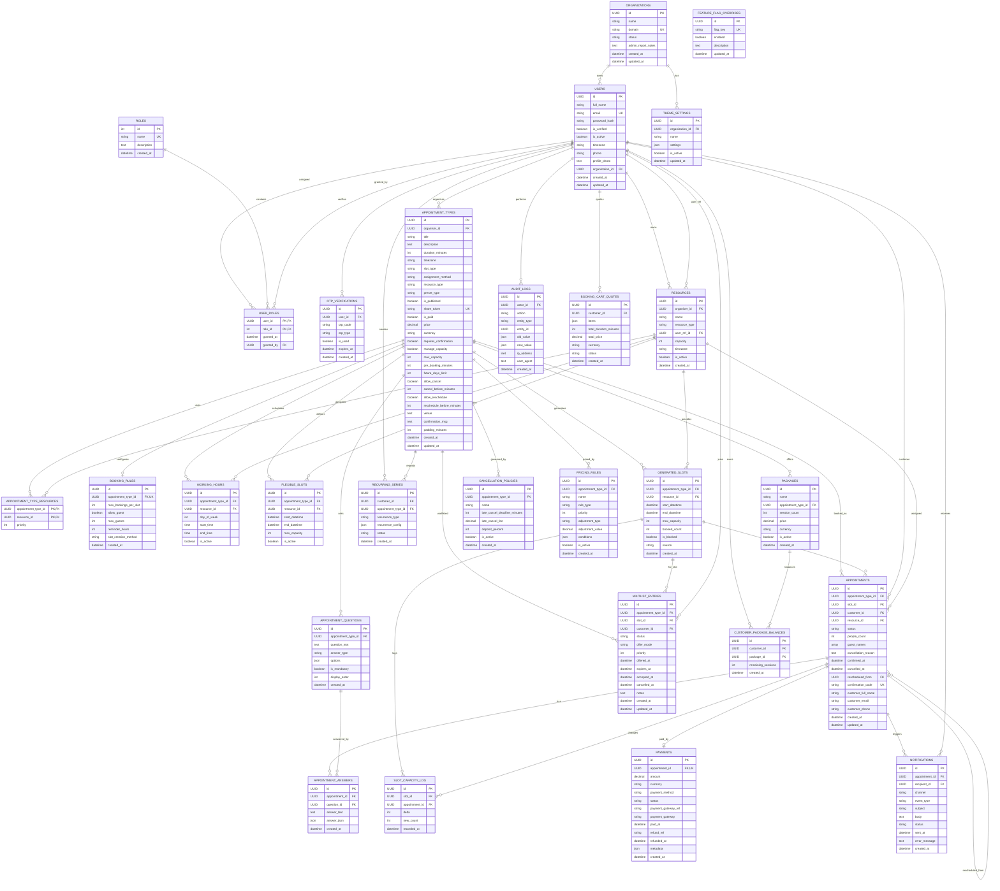

# Database ER Diagram

```mermaid
erDiagram
    ORGANIZATIONS {
        UUID id PK
        string name
        string domain UK
        string status
        text admin_report_notes
        datetime created_at
        datetime updated_at
    }

    USERS {
        UUID id PK
        string full_name
        string email UK
        string password_hash
        boolean is_verified
        boolean is_active
        string timezone
        string phone
        text profile_photo
        UUID organization_id FK
        datetime created_at
        datetime updated_at
    }

    ROLES {
        int id PK
        string name UK
        text description
        datetime created_at
    }

    USER_ROLES {
        UUID user_id PK, FK
        int role_id PK, FK
        datetime granted_at
        UUID granted_by FK
    }

    OTP_VERIFICATIONS {
        UUID id PK
        UUID user_id FK
        string otp_code
        string otp_type
        boolean is_used
        datetime expires_at
        datetime created_at
    }

    APPOINTMENT_TYPES {
        UUID id PK
        UUID organiser_id FK
        string title
        text description
        int duration_minutes
        string timezone
        string slot_type
        string assignment_method
        string resource_type
        string preset_type
        boolean is_published
        string share_token UK
        boolean is_paid
        decimal price
        string currency
        boolean requires_confirmation
        boolean manage_capacity
        int max_capacity
        int pre_booking_minutes
        int future_days_limit
        boolean allow_cancel
        int cancel_before_minutes
        boolean allow_reschedule
        int reschedule_before_minutes
        text venue
        text confirmation_msg
        int padding_minutes
        datetime created_at
        datetime updated_at
    }

    RESOURCES {
        UUID id PK
        UUID organiser_id FK
        string name
        string resource_type
        UUID user_ref_id FK
        int capacity
        string timezone
        boolean is_active
        datetime created_at
    }

    APPOINTMENT_TYPE_RESOURCES {
        UUID appointment_type_id PK, FK
        UUID resource_id PK, FK
        int priority
    }

    BOOKING_RULES {
        UUID id PK
        UUID appointment_type_id FK, UK
        int max_bookings_per_slot
        boolean allow_guest
        int max_guests
        int reminder_hours
        string slot_creation_method
        datetime created_at
    }

    APPOINTMENT_QUESTIONS {
        UUID id PK
        UUID appointment_type_id FK
        text question_text
        string answer_type
        json options
        boolean is_mandatory
        int display_order
        datetime created_at
    }

    WORKING_HOURS {
        UUID id PK
        UUID appointment_type_id FK
        UUID resource_id FK
        int day_of_week
        time start_time
        time end_time
        boolean is_active
    }

    FLEXIBLE_SLOTS {
        UUID id PK
        UUID appointment_type_id FK
        UUID resource_id FK
        datetime start_datetime
        datetime end_datetime
        int max_capacity
        boolean is_active
    }

    GENERATED_SLOTS {
        UUID id PK
        UUID appointment_type_id FK
        UUID resource_id FK
        datetime start_datetime
        datetime end_datetime
        int max_capacity
        int booked_count
        boolean is_blocked
        string source
        datetime created_at
    }

    APPOINTMENTS {
        UUID id PK
        UUID appointment_type_id FK
        UUID slot_id FK
        UUID customer_id FK
        UUID resource_id FK
        string status
        int people_count
        array guest_names
        text cancellation_reason
        datetime confirmed_at
        datetime cancelled_at
        UUID rescheduled_from FK
        string confirmation_code UK
        string customer_full_name
        string customer_email
        string customer_phone
        datetime created_at
        datetime updated_at
    }

    APPOINTMENT_ANSWERS {
        UUID id PK
        UUID appointment_id FK
        UUID question_id FK
        text answer_text
        json answer_json
        datetime created_at
    }

    SLOT_CAPACITY_LOG {
        UUID id PK
        UUID slot_id FK
        UUID appointment_id FK
        int delta
        int new_count
        datetime recorded_at
    }

    PAYMENTS {
        UUID id PK
        UUID appointment_id FK, UK
        decimal amount
        string currency
        string payment_method
        string status
        string payment_gateway_ref
        string payment_gateway
        datetime paid_at
        string refund_ref
        datetime refunded_at
        json metadata
        datetime created_at
    }

    NOTIFICATIONS {
        UUID id PK
        UUID appointment_id FK
        UUID recipient_id FK
        string channel
        string event_type
        string subject
        text body
        string status
        datetime sent_at
        text error_message
        datetime created_at
    }

    AUDIT_LOGS {
        UUID id PK
        UUID actor_id FK
        string action
        string entity_type
        UUID entity_id
        json old_value
        json new_value
        inet ip_address
        text user_agent
        datetime created_at
    }

    FEATURE_FLAG_OVERRIDES {
        UUID id PK
        string flag_key UK
        boolean enabled
        text description
        datetime updated_at
    }

    WAITLIST_ENTRIES {
        UUID id PK
        UUID appointment_type_id FK
        UUID slot_id FK
        UUID customer_id FK
        string status
        string offer_mode
        int priority
        datetime offered_at
        datetime expires_at
        datetime accepted_at
        datetime cancelled_at
        text notes
        datetime created_at
        datetime updated_at
    }

    BOOKING_CART_QUOTES {
        UUID id PK
        UUID customer_id FK
        json items
        int total_duration_minutes
        decimal total_price
        string currency
        string status
        datetime created_at
    }

    RECURRING_SERIES {
        UUID id PK
        UUID customer_id FK
        UUID appointment_type_id FK
        string recurrence_type
        json recurrence_config
        string status
        datetime created_at
    }

    PACKAGES {
        UUID id PK
        string name
        UUID appointment_type_id FK
        int session_count
        decimal price
        string currency
        boolean is_active
        datetime created_at
    }

    CUSTOMER_PACKAGE_BALANCES {
        UUID id PK
        UUID customer_id FK
        UUID package_id FK
        int remaining_sessions
        datetime created_at
    }

    CANCELLATION_POLICIES {
        UUID id PK
        UUID appointment_type_id FK
        string name
        int late_cancel_deadline_minutes
        decimal late_cancel_fee
        int deposit_percent
        boolean is_active
        datetime created_at
    }

    PRICING_RULES {
        UUID id PK
        UUID appointment_type_id FK
        string name
        string rule_type
        int priority
        string adjustment_type
        decimal adjustment_value
        json conditions
        boolean is_active
        datetime created_at
    }

    THEME_SETTINGS {
        UUID id PK
        UUID organization_id FK
        string name
        json settings
        boolean is_active
        datetime updated_at
    }

    ORGANIZATIONS ||--o{ USERS : owns
    ORGANIZATIONS ||--o{ THEME_SETTINGS : has

    USERS ||--o{ USER_ROLES : assigned
    ROLES ||--o{ USER_ROLES : contains
    USERS ||--o{ USER_ROLES : granted_by
    USERS ||--o{ OTP_VERIFICATIONS : verifies

    USERS ||--o{ APPOINTMENT_TYPES : organizes
    USERS ||--o{ RESOURCES : owns
    USERS ||--o{ RESOURCES : user_ref
    APPOINTMENT_TYPES ||--o{ APPOINTMENT_TYPE_RESOURCES : uses
    RESOURCES ||--o{ APPOINTMENT_TYPE_RESOURCES : assigned

    APPOINTMENT_TYPES ||--o| BOOKING_RULES : configures
    APPOINTMENT_TYPES ||--o{ APPOINTMENT_QUESTIONS : asks
    APPOINTMENT_TYPES ||--o{ WORKING_HOURS : schedules
    RESOURCES ||--o{ WORKING_HOURS : has
    APPOINTMENT_TYPES ||--o{ FLEXIBLE_SLOTS : defines
    RESOURCES ||--o{ FLEXIBLE_SLOTS : has
    APPOINTMENT_TYPES ||--o{ GENERATED_SLOTS : generates
    RESOURCES ||--o{ GENERATED_SLOTS : provides

    APPOINTMENT_TYPES ||--o{ APPOINTMENTS : booked_as
    GENERATED_SLOTS ||--o{ APPOINTMENTS : booked_in
    USERS ||--o{ APPOINTMENTS : customer
    RESOURCES ||--o{ APPOINTMENTS : assigned
    APPOINTMENTS ||--o{ APPOINTMENTS : rescheduled_from

    APPOINTMENTS ||--o{ APPOINTMENT_ANSWERS : has
    APPOINTMENT_QUESTIONS ||--o{ APPOINTMENT_ANSWERS : answered_by
    GENERATED_SLOTS ||--o{ SLOT_CAPACITY_LOG : logs
    APPOINTMENTS ||--o{ SLOT_CAPACITY_LOG : changes

    APPOINTMENTS ||--o| PAYMENTS : paid_by
    APPOINTMENTS ||--o{ NOTIFICATIONS : triggers
    USERS ||--o{ NOTIFICATIONS : receives
    USERS ||--o{ AUDIT_LOGS : performs

    APPOINTMENT_TYPES ||--o{ WAITLIST_ENTRIES : waitlisted
    GENERATED_SLOTS ||--o{ WAITLIST_ENTRIES : for_slot
    USERS ||--o{ WAITLIST_ENTRIES : joins
    USERS ||--o{ BOOKING_CART_QUOTES : quotes
    USERS ||--o{ RECURRING_SERIES : creates
    APPOINTMENT_TYPES ||--o{ RECURRING_SERIES : repeats

    APPOINTMENT_TYPES ||--o{ PACKAGES : offers
    USERS ||--o{ CUSTOMER_PACKAGE_BALANCES : owns
    PACKAGES ||--o{ CUSTOMER_PACKAGE_BALANCES : balances
    APPOINTMENT_TYPES ||--o{ CANCELLATION_POLICIES : governed_by
    APPOINTMENT_TYPES ||--o{ PRICING_RULES : priced_by
```
